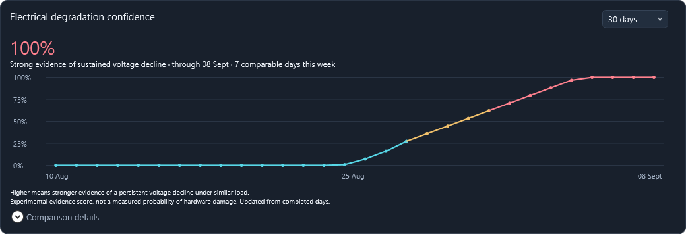

# ConnectorWatch

Private rail monitoring requires an authenticated maintainer approval for the
exact board, driver, and embedded reader. See [driver approvals](docs/DRIVER-CATALOG.md).
The first catalog carries maintainer approvals for 616.56 and 616.92 on the
documented ASUS TUF RTX 5090 identity; [616.92's evidence record](docs/DRIVER-616.92.md)
distinguishes that approval from the available structural tests.

A Windows-first dashboard for monitoring RTX 5090 input-rail voltage and electrical trends over time.

[Download for Windows](https://github.com/Shaderx/ConnectorWatch/releases/download/app-stable/ConnectorWatch-Setup.exe) · [User guide](docs/USER-GUIDE.md) · [Release notes](docs/RELEASE-1.5.0.md)

Version 1.5.0 uses the project's **self-signed certificate**. Windows can show an
unrecognized publisher or SmartScreen prompt. Obtain it from this repository's
release page and follow the [signature verification instructions](docs/INSTALLATION.md).
The public CA signing path remains available for a later release.

*Synthetic demonstration. The percentage summarizes evidence of voltage decline; it is not a measured probability of hardware damage.*

## A clearer view of your readings

- **Live dashboard** — input voltage, power, PCIe supply, warnings and sensor status.
- **Long-term confidence** — daily comparisons across **7, 30 or 90 days**, with 30 days selected by default.
- **Detailed electrical trends** — load-matched voltage changes, observed variation and sample details for closer inspection.
- **Less disk activity** — buffered telemetry, automatic compression of older recordings, and periodic confidence checkpoints.

## Start on Windows

The new installer is built through the protected signed-release process described
in [installation and migration](docs/INSTALLATION.md). It installs for your Windows
account, bundles the runtime, and preserves configuration and history on upgrades.
The installer includes the signed driver catalog and application update trust.

After installation, launch **ConnectorWatch** from the Start menu. Leave `GpuUuid`
blank to detect one NVIDIA GPU. Version 1.5 checks driver approvals automatically
and provides a manual refresh.
If approval is pending, unavailable, or withdrawn, public GPU telemetry can continue
while private rail readings are paused. Users do not need to validate drivers.

Closing the window keeps monitoring in the system tray. Use **Stop monitoring and exit** to stop both applications, or **Exit GUI — keep monitoring** to close only the dashboard.

## Reading the confidence chart

**Up means stronger evidence of a sustained voltage decline under comparable load.** The score combines the size and persistence of the decline with the number of comparable days. It can fall when measurements recover.

The chart needs at least **three comparable completed days**. Missing, stale or insufficient measurements stay unscored. They do not become a reassuring zero. Expand **Comparison details** for the selected load band and measurement limitations.

The [user guide](docs/USER-GUIDE.md#long-term-degradation-confidence) explains the calculation and the detailed chart.

## Storage that stays out of the way

| Data | Storage policy |
| --- | --- |
| Raw telemetry | Buffered in memory; normally flushed every **30 seconds**. Warnings, shutdown and buffer limits can flush sooner. |
| Older recordings | The current UTC day and previous two days remain CSV. Older days are automatically compressed to **`.csv.gz`** in the background. Archives are retained. |
| Confidence history | Kept in memory, with changed history saved every **30 minutes** and on normal GUI exit. Initial backfill can save immediately; unchanged history is not rewritten. |
| Live charts | Read live data and use a bounded recent history in memory. |
| Diagnostics | Rotating GUI and monitor logs under `%LOCALAPPDATA%\ConnectorWatch\logs`. |

The confidence chart reads compressed recordings directly. Compression verifies the archive before removing its original CSV. An interrupted checkpoint can be rebuilt from retained recordings; an abrupt stop can still lose unflushed live samples.

## Upgrade without losing history

The dashboard offers app updates with release notes and asks before restarting.
The installer stops monitoring, backs up the previous application, and preserves
configuration, references, and history. Its optional import page copies an existing
portable configuration and recordings while retaining the original directory.
See [installation and recovery](docs/INSTALLATION.md).

Diagnostic logs remain outside the release folder and survive upgrades.

## Supported setup

**Experimental Windows x64 release.** The direct reader was physically validated on one **ASUS TUF RTX 5090**, NVIDIA driver **616.56**, with one NVIDIA GPU. The signed catalog controls current acceptance; historical checks alone do not approve a driver. Multiple GPUs fail closed. See [validation and limits](docs/VALIDATION.md).

ConnectorWatch measures voltage trends, not individual contact temperature or connector safety. It cannot guarantee a warning before damage. It does not change GPU settings or power limits.

## Further reading

[Configuration and operation](docs/USER-GUIDE.md) · [Architecture](docs/ARCHITECTURE.md) · [Offline replay](docs/REPLAY.md) · [Build and release](docs/RELEASING.md)

[MIT license](LICENSE). Bundled runtimes retain their own licenses and notices.
Published portable releases predate the signed-installer delivery pipeline.
