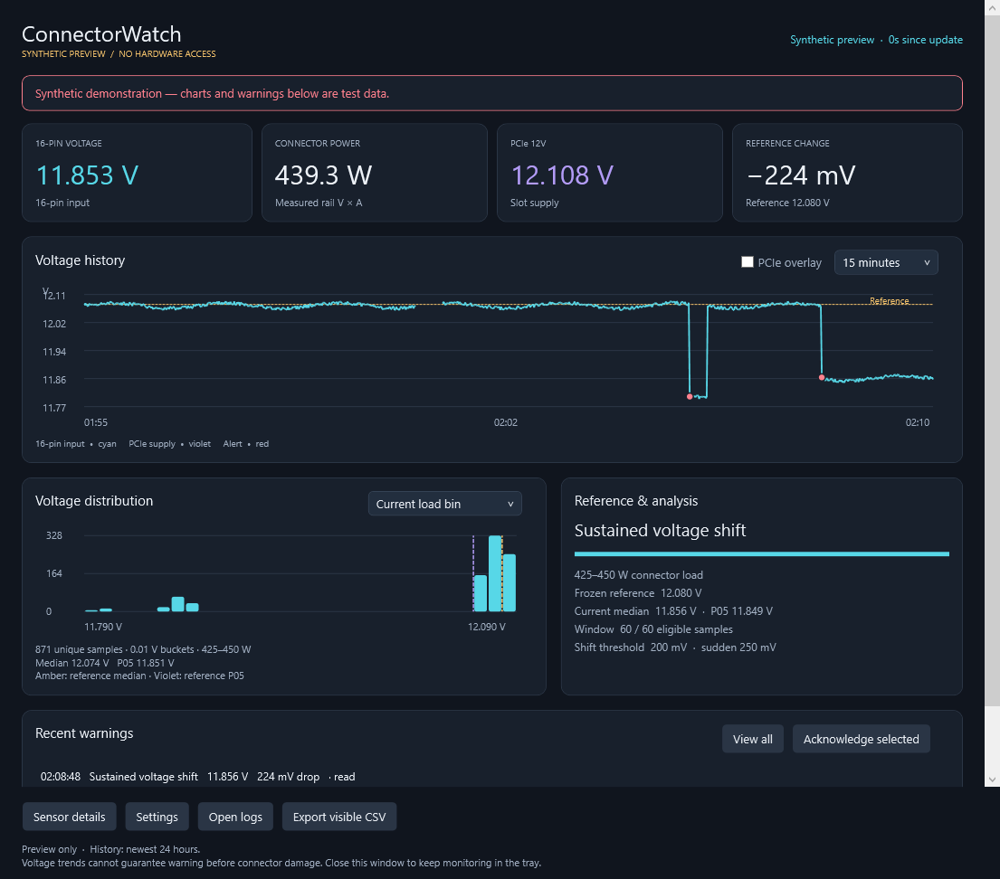

# ConnectorWatch

ConnectorWatch is an experimental Windows monitor for the 16-pin input-voltage trend of a supported RTX 5090 setup. It consists of a Windows WPF dashboard and a headless .NET 8 daemon. The daemon owns all GPU access, records timestamped telemetry, and evaluates voltage changes within comparable load bands. The dashboard reads the daemon's files and control endpoint.

Release **v1.2.0** is experimental. The direct native reader was physically validated on one ASUS TUF RTX 5090 configuration. Other units of the same board family are experimental, multi-GPU systems fail closed, and other boards or driver versions are unsupported by the direct reader.



*Synthetic preview; it does not show a live hardware reading.*

ConnectorWatch is a voltage trend logger, not a connector-safety detector. Aggregate voltage can remain normal while one contact overheats. The program cannot measure per-pin current, connector temperature, contact resistance, or fast transients, and it cannot guarantee a warning before damage. It does not tune the GPU, change power limits, write hardware settings, or shut down the computer.

Licensed under [MIT](LICENSE). Bundled Microsoft .NET runtimes retain their own licenses and notices in the package's `licenses` directory.

## Download and first run

Download the Windows archive from [GitHub Releases](https://github.com/Shaderx/ConnectorWatch/releases). Extract the complete archive to a directory you control; the package is portable and includes the .NET 8 runtime. A compatible NVIDIA Windows driver is still required for NVML and the direct reader.

For a single NVIDIA GPU, leave `GpuUuid` blank (the default) or set it to `"auto"`, then launch the GUI. The daemon detects the UUID using NVML; no manual configuration or nvidia-smi command is needed. Sensor details shows the resolved UUID. Detection does not modify config.json, and all native board/driver restrictions still apply. Zero or multiple NVIDIA GPUs fail closed in automatic mode.

To pin an explicit UUID instead, find it in PowerShell:

```powershell
nvidia-smi --query-gpu=uuid --format=csv,noheader
```

Optionally copy that UUID into `config.json`. The public sample selects automatic GPU detection and the direct source:

```json
{
  "GpuUuid": "",
  "SampleSeconds": 1,
  "DataDirectory": "data",
  "DesktopAlerts": true,
  "VoltageSource": "direct",
  "AnalysisLoadSource": "CONNECTOR_POWER"
}
```

Keep the rest of the package's configuration fields when editing the file. `VoltageSource` must remain `direct` for the validated native path. An explicit UUID bypasses automatic selection; it does not enable multi-GPU support for direct rails. Only one daemon may write to a data directory.

`AnalysisLoadSource` pins the comparison basis for the daemon lifetime. Supported values are `CONNECTOR_CURRENT`, `CONNECTOR_POWER`, `NVML_BOARD_POWER`, and `EXTERNAL_SENSOR_POWER`. If the selected measurement is missing or stale, analysis becomes unavailable; it never silently substitutes a different source. Connector-current qualification is converted to the existing watt-binned axis only with voltage from the same fresh connector observation. Direct-reader power is derived from that rail's V×I and is not an independent third measurement.

Reference learning is a two-step lifecycle. A completed learning window is
written as `REFERENCE_UNVERIFIED` candidate evidence; it is never silently
promoted into a comparison baseline. An operator must send the identity-bound
control command `accept-reference` (or `migrate-reference` when explicitly
reviewing a legacy baseline), optionally with `operator`, `note`, and
`explicit_legacy_migration` fields. `archive-reference` removes the active
accepted model and retains an immutable archive entry before relearning. The
daemon rejects these commands when the instance identity is stale, the source
is degraded, or the candidate is incomplete. Accepted values are frozen and
are not altered by later learning. The current state, compatibility, candidate,
accepted snapshot, and migration detail are exposed under
`reference_lifecycle` in `status.json` and live status.

Operator actions are available through the same identity-checked control pipe:

```powershell
.\ConnectorWatch.exe --config .\config.json --accept-reference --operator "name" --note "known-good inspection"
.\ConnectorWatch.exe --config .\config.json --migrate-reference --operator "name" --note "reviewed legacy evidence"
.\ConnectorWatch.exe --config .\config.json --archive-reference --operator "name" --note "hardware changed"
.\ConnectorWatch.exe --config .\config.json --acknowledge-incident --incident-id "incident-id" --operator "name"
.\ConnectorWatch.exe --config .\config.json --resolve-incident --incident-id "incident-id" --operator "name" --note "inspection complete"
```

Acknowledgement records that an incident was seen. It does not resolve the incident, change detector state, or accept a reference.

Start the dashboard with `ConnectorWatch.Gui.exe` or `Start-GUI.cmd`. It starts one hidden daemon when the data directory is not already owned and attaches to an existing compatible daemon when one is running. To run without a window, start `ConnectorWatch.exe`, `Start.cmd`, or `RunBackground.ps1` from the extracted directory. The headless executable has no tray icon.

Pressing **X** or **Alt+F4** hides the dashboard in the notification area; monitoring continues. Use the tray menu or double-click the icon to restore it. **Exit GUI — keep monitoring** closes the dashboard and leaves the daemon running. **Stop monitoring and exit** requests a graceful daemon stop and waits for its stopped state.

Startup registration is opt-in and is not installed by the release. The dashboard's Settings page can register the GUI or background monitor for the current Windows account, or disable startup. The equivalent package commands are:

```powershell
.\Configure-Startup.ps1 -Mode Gui
.\Configure-Startup.ps1 -Mode Monitor
.\Configure-Startup.ps1 -Mode Remove
```

Registration does not request elevation. If Windows rejects it, the dashboard reports the error.

## Dashboard and recorded data

The live cards show 16-pin voltage, connector or comparison power, PCIe voltage, and the change from the current reference. History can show 15 minutes, one hour, or 24 hours, with an optional PCIe overlay. Missing readings remain gaps. Minima and maxima are preserved so short dips are not hidden by display averaging. Hover over a point for its exact observation. Open a warning to inspect the time at which it occurred, then use **Back to live** to return to the current range.

The histogram counts distinct voltage samples in the selected load bin and time range. It excludes settling and other ineligible analysis states. Saved median and fifth-percentile markers are shown when available. **All loads** is a descriptive distribution that includes idle samples and does not compare them with a reference. The histogram does not invent a reference distribution from summary statistics.

Warnings describe the detector's comparison state, such as baseline learning, a baseline shift, a sudden droop, a gap, or unavailable voltage. Acknowledging a warning only marks it read; it does not clear the active condition or alter detector settings. **View all** expands the loaded warning list. **Export visible CSV** exports the observations represented by the selected history view.

The daemon writes these files under `DataDirectory`:

| File | Purpose |
| --- | --- |
| `telemetry-YYYY-MM-DD.csv` | UTC observations, NVML telemetry, voltage-source values, analysis fields, and detector status |
| `status.json` | Most recent complete state, including timestamps and stopped state |
| `events.csv` | Status transitions and details |
| `baseline.json` | Compatibility mirror with the historical `Bins` shape; accepted values only populate `Reference` |
| `reference.json` | Versioned candidate/accepted reference lifecycle, identity, archives, and migration metadata |
| `differential-model.json` | Frozen identity-bound robust model fitted only from qualified accepted-reference evidence |
| `incidents.json` | Latched incident summaries, acknowledgement/resolution records, and bounded forensic windows |
| `power-limit-watchdog.json` | Read-only observed power-limit baseline and drift history |
| `monitor.lock` | Single-writer guard for the data directory |

The dashboard shows stale or stopped readings as unavailable. It records monitoring loss separately, including when the native daemon terminates. Windows notification settings can suppress tray notifications; the dashboard banner and warning history remain available. When the dashboard owns presentation, only one GUI receives the daemon's heartbeat lease. If it exits unexpectedly, the daemon resumes headless warnings, including for an active warning that began while the GUI owned presentation.

## Hybrid live storage (v1.2.0)

Live status and recent observations stay in bounded daemon RAM and reach the dashboard through the current-user control pipe. The daemon retains at most 512 recent rows (also capped at 512 KiB of text); the GUI merges these with saved history without duplicating samples when batches reach disk.

`FlushSeconds` defaults to 30 and accepts 1–60 seconds. Routine telemetry, transitions, status and baseline checkpoints are written in batches at that interval (or earlier at the buffer threshold). New voltage-trend warnings, unavailable-source transitions and terminal source failures trigger an immediate checkpoint; graceful shutdown flushes pending samples before recording stopped state. Temporary Windows sharing/access conflicts receive bounded retries. Persistent storage failures stop the daemon and record diagnostics under `%LOCALAPPDATA%\ConnectorWatch\logs`, independently of the data directory.

An abrupt process termination can lose the unflushed interval. Checkpoints use normal operating-system file buffering, so power-loss durability is not guaranteed. `status.json` is a disk checkpoint, not the live one-second transport; scripts requiring live state should use the instance-checked `live` control request after `hello`. Upgrade the GUI and daemon together.

**Keep active data outside OneDrive and other cloud-synced directories.** With the default relative `DataDirectory: "data"`, install the entire package in a local, non-synced folder. Existing explicit data paths and baselines are preserved; this release does not migrate storage or automatically detect every sync provider. Copy closed exports to cloud storage only after capture. Less frequent writing does not make a synced runtime directory supported.

## How the detector should be read

The default analyzer uses 25 W load bins, ignores analysis below 100 W, and waits for five successive fresh samples in a bin. The first 300 eligible readings learn a candidate median and fifth percentile for each bin. The candidate remains unverified until an operator explicitly accepts it; only then does the rolling window compare against those frozen values. The rolling window contains at most 60 eligible readings no older than 30 minutes. The example thresholds are a 0.20 V sustained median or fifth-percentile loss, and a 0.25 V single-reading sudden droop, with five consecutive eligible updates required for a sustained alert.

Acceptance also freezes a robust differential voltage model using one explicitly labelled load proxy plus available board-power, temperature, fan, and thermal features. The live residual is observed voltage minus model-expected voltage. A fast residual detector catches abrupt changes while a time-aware EWMA looks for persistent drift; gaps, poor coverage, and identity changes make the result unavailable or degraded. A reported voltage-per-amp or voltage-per-watt slope is descriptive evidence, not a connector-resistance measurement. Incidents latch detector evidence with bounded pre-trigger and post-trigger observations so a transient cannot disappear merely because the live value recovers.

These thresholds are comparison settings, not electrical safety limits. Recheck a change at similar steady power and temperature. A source gap, restart, repeated timestamp, or load transition interrupts continuity and requires settling again. A saved reference belongs to its source, GPU, and configuration. Identity mismatch is reported as `REFERENCE_INVALID`; source degradation reports `REFERENCE_STALE` without deleting the accepted snapshot. Use the explicit `archive-reference` operation after changing a cable, PSU, sensor, GPU, or analysis configuration instead of resetting state merely to silence an alert. A legacy `baseline.json` is imported as an unverified candidate and requires explicit migration acknowledgement; migration never claims that the old values were known healthy.

The direct reader is guarded by the target identity and topology checks described in [the architecture](docs/ARCHITECTURE.md). Its native setup is fail-closed: a rejected identity, multiple GPUs, incompatible driver or board, missing library, failed initialization, or possible native timeout records voltage as unavailable and does not retry or silently switch sources. NVML sensor fields that fail independently are left blank. The daemon never converts GPU core voltage or total board power into a connector-voltage measurement.

The power-limit watchdog is observation-only: it detects reported-limit changes, stale readings, and identity discontinuities but contains no write path. The optional downward-only mitigation design remains disabled and mock-only; this release has no native adapter that can change a GPU power limit.

## Build, publish, and offline checks

The public source tree is organized as follows:

```text
src/ConnectorWatch       .NET 8 headless daemon and native reader
src/ConnectorWatch.Gui   Windows WPF dashboard and tray host
scripts/Publish.ps1      self-contained Windows package publisher
dist/ConnectorWatch-win-x64
```

Build from a Windows machine with the .NET 8 SDK. The source projects use the checked-in NuGet configuration; the publish script creates the self-contained package under `dist/ConnectorWatch-win-x64`.

```powershell
dotnet build .\src\ConnectorWatch\ConnectorWatch.csproj -c Release --configfile .\src\ConnectorWatch\NuGet.Config
dotnet build .\src\ConnectorWatch.Gui\ConnectorWatch.Gui.csproj -c Release --configfile .\src\ConnectorWatch.Gui\NuGet.Config
.\scripts\Publish.ps1
```

The daemon self-test is offline and does not load NVML or touch a GPU:

```powershell
dotnet run --project .\src\ConnectorWatch\ConnectorWatch.csproj -- --self-test
```

The WPF demo and UI self-test use synthetic data and do not attach to a live daemon:

```powershell
dotnet run --project .\src\ConnectorWatch.Gui\ConnectorWatch.Gui.csproj -- --demo --ui-self-test --test-output .\gui-tests.json
```

Recorded CSV/JSON evidence can be characterized without initializing NVML or the direct reader:

```powershell
dotnet run --project .\src\ConnectorWatch\ConnectorWatch.csproj -- --characterize .\data
```

See [docs/REPLAY.md](docs/REPLAY.md) for deterministic replay, [docs/RECORDED-DATA-CHARACTERIZATION.md](docs/RECORDED-DATA-CHARACTERIZATION.md) for the captured-data report, and [docs/VALIDATION.md](docs/VALIDATION.md) for tested behavior and limitations. A passing offline self-test does not validate a user's GPU, driver, cabling, connector, or public release build.

## Support boundary

The direct native path is intended for Windows x64 and retains the validated hardware identity `PCI0x2B8510DE`, subsystem `0x89EE1043`, with NVIDIA driver `616.56`. The physically validated scope is one ASUS TUF RTX 5090 configuration. Same-board units are experimental until independently checked. Multiple GPUs fail closed. Other boards and other driver versions are unsupported by the direct path and must not be treated as compatible because the card name looks similar.

The daemon's managed NVML telemetry core is portable in principle and can be built for other platforms, but this release supplies the Windows WPF GUI and the Windows direct rail reader. A Linux build may retain ordinary NVML logging where the driver provides `libnvidia-ml.so.1`; it does not provide the Windows native rail path or a Linux GUI.

HWiNFO CSV and newline-delimited JSON are optional source adapters in the daemon for separately validated integrations. They are not a substitute for proving that a value represents the 16-pin input rail. Keep source timestamps and freshness visible when evaluating any external adapter.

## Automated releases

Pushes and pull requests run Windows and Linux-core checks. Matching version tags publish tested Windows prereleases with checksums and build metadata. See [the release guide](docs/RELEASING.md).
