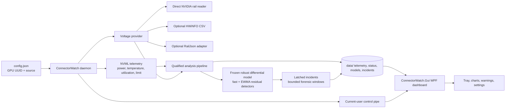

# ConnectorWatch architecture

ConnectorWatch is split into a headless .NET 8 daemon and a Windows WPF presentation process. The daemon is the only process that owns GPU and voltage-source reads. The GUI consumes persisted telemetry and a small current-user control protocol; it does not call NVML, NVAPI, or the native rail ABI.

## Daemon

At each sample, the daemon reads NVML board power, temperature, utilization, and requested power limit for the configured GPU UUID. A voltage provider supplies a typed electrical sample with explicitly nullable connector and PCIe voltage/current/power fields, provenance, raw legacy extras, and conservative freshness metadata. Unsupported current remains unavailable rather than being inferred from voltage or power. Direct-reader power is the derived V×I result from the same rail observation, not an independent measurement. The provider's values remain distinct from GPU core voltage and from PCIe slot voltage.

The default public configuration selects `VoltageSource: "direct"` and `AnalysisLoadSource: "CONNECTOR_POWER"`. The daemon also contains explicit adapters for HWiNFO CSV and newline-delimited JSON. `auto` can be used by an advanced operator who has deliberately configured an external source; an explicit source does not silently change to another provider. The analysis load source is resolved once, included in reference identity, and never falls back per sample. A missing selected load or stale required field creates `ANALYSIS_LOAD_UNAVAILABLE` and a continuity gap. Legacy configurations without the field receive a one-time provider-compatible resolution at startup.

The newline-delimited JSON adapter reads at most the newest 128 KiB from the file tail. When that window begins inside a record it discards the partial leading bytes, ignores an unterminated append, and returns the newest complete non-empty record. A single record larger than the bound is unavailable unless a later complete record fits in the window; the adapter never rescans an unbounded growing file.

The analyzer groups eligible samples into 25 W bins. It waits for stable samples after a load transition, learns a per-bin median and fifth percentile, and publishes a candidate snapshot. Candidate values remain outside comparison until an identity-bound operator command explicitly accepts them. Acceptance freezes both the snapshot and a robust differential voltage model fitted from qualified evidence using one labelled load proxy and available operating-condition features. Later learning can produce a separate candidate without mutating accepted artifacts. `accept-reference`, `migrate-reference`, and `archive-reference` commands are instance-checked by the current-user control endpoint. A source degradation leaves accepted evidence available for forensics but marks it stale and prevents comparison; a GPU/source/configuration mismatch marks it invalid.

The differential model emits expected voltage, residual, and an explicitly unit-labelled descriptive slope. A fast residual detector and a time-aware EWMA detector consume that output. Missing samples, insufficient coverage, poor conditioning, discontinuities, and stale sources remain explicit states rather than being filled or reinterpreted. Detector transitions latch incidents with deterministic identifiers and bounded pre-trigger, trigger, and post-trigger windows. Acknowledgement and resolution are separate operator records and neither mutates a reference. The reported slope is not represented as connector resistance.

The power-limit watchdog records the optional configured desired cap, reported management limit, enforced limit where supported, connector power, board power, identity, and time continuity as independent nullable channels. It detects drift, staleness, discontinuity, and bounded non-enforcement without exposing a hardware write path. Unsupported enforcement telemetry is `PARTIALLY_VERIFIED`, not inferred from board power. A separate optional mitigation policy is disabled by default and tested only through fake authorization, adapter, audit, and bounded load-observation seams. Its lifecycle distinguishes requested, accepted readback, verified load reduction, and failure/unobservable states; no production/native adapter or helper is wired to it.

The daemon publishes live status and up to 512 recent CSV rows (512 KiB text cap) through the instance-checked `live` control command. Routine daily telemetry and transitions accumulate in bounded RAM, then flush with status, the legacy baseline mirror, and the versioned reference lifecycle every `FlushSeconds` (30 by default, 1–60 allowed), at the buffer threshold, on an urgent warning/failure, and on graceful shutdown. The GUI merges pipe history with disk history using observation timestamps. `status.json` is a checkpoint and can lag live state by the flush interval. Atomic replacements and append opens retry temporary Windows sharing/access failures with bounded backoff; appends are not retried after writing may have begun. A lock file prevents multiple writers from using one data directory. On a clean signal, control stop, or finite sample run it marks the status as stopped and saves the lifecycle. File and terminal voltage-source failures are surfaced as process failure; the logger does not continue while claiming that monitoring is live.

## Direct native reader and identity gates

The direct reader is a narrow Windows x64 provider for the validated NVIDIA path. Its retained native identity is:

- PCI identity `PCI0x2B8510DE`;
- subsystem identity `0x89EE1043`;
- NVIDIA driver version `616.56`.

The public source does not embed a machine-specific GPU UUID. An empty or `auto` UUID in `config.json` asks NVML to enumerate devices and read the UUID only when exactly one NVIDIA GPU exists. An explicit UUID bypasses discovery. The resolved identity is used for logs and baseline identity and exposed as `gpu_uuid` in status.json; the configuration file is never rewritten. NVML initialization is balanced by shutdown even if discovery fails. Before a direct read is allowed, the managed NVML path and the native NVAPI path apply the single-GPU guard and verify that the configured GPU is the device being served. The guard uses NVML's device-count and UUID query surface; see the [official NVML device queries](https://docs.nvidia.com/deploy/nvml-api/group__nvmlDeviceQueries.html). Multiple visible GPUs fail closed, even if one of them has a familiar model name. The identity checks also reject an unsupported board or driver before any rail call.

Native setup is one-shot. If the driver library is missing, the identity gate fails, initialization returns an unsupported result, or a native call cannot complete within the bounded wait, the daemon records `VOLTAGE_UNAVAILABLE` and stops. It does not retry the setup, fall through after a possible native timeout, unload a library while an in-flight call may still own its buffers, or write a hardware setting. This preserves a clear boundary between a verified direct source and an unavailable one.

The reader's decoder is guarded by request sizes, canaries, expected metadata, and freshness markers. Native work runs through a bounded worker path. A completed call disposes its task resources; an in-flight timed-out call retains ownership until it completes. This is a safety boundary for the process and does not establish a hardware freshness guarantee.

## GUI and control protocol

The WPF process loads the configured data directory, reads the newest bounded portion of daily files, and displays the latest status, history, distributions, and warnings. It can start a hidden daemon when the data directory is free, attach to an existing compatible daemon, or show an unavailable/read-only state. The control endpoint is current-user scoped and carries protocol/version, process, instance, data-directory, and lease information so a second GUI cannot become a competing presentation owner.

The GUI's five-second heartbeat lease controls who presents desktop warnings. If the lease expires, the daemon resumes headless presentation for an active warning. Closing the dashboard releases old chart snapshots while the daemon continues to record data. The dashboard's local placement, range, acknowledgements, and monitoring-loss events are separate from the persisted detector baseline.

History loading is bounded. The GUI considers at most the newest two daily files, caps the initial tail per file, caps retained voltage observations and warning records, rejects oversized records, and reads with pooled chunks. It preserves gaps and reports truncation in the UI. Identifier sets use FIFO bounds, chart brushes are reused and frozen, and warning controls are rebuilt only when their contents change. These limits bound application-owned collections; they do not promise that Windows, WPF, or a future driver has no unrelated cache growth.

## Analysis and persistence contract

The main files are:

| File | Producer | Consumer | Contract |
| --- | --- | --- | --- |
| `telemetry-YYYY-MM-DD.csv` | daemon | GUI and offline tools | legacy columns followed by additive typed rail, source, freshness, provenance, and analysis-unit fields |
| `status.json` | daemon | GUI, scripts, operators | additive schema 3 state with typed electrical/load/reference, differential prediction, incident summaries, read-only watchdog, timestamps, and `stopped` |
| `events.csv` | daemon | GUI and operators | status transitions and details |
| `baseline.json` | daemon | GUI and legacy consumers | historical `Identity`/`Bins` mirror; `Reference` is populated only from an accepted snapshot |
| `reference.json` | daemon | daemon, operator tooling | versioned identity, unverified candidate, frozen accepted snapshot, archive history, compatibility, and migration metadata |
| `differential-model.json` | daemon | daemon and offline tools | immutable identity-bound robust model and artifact hash |
| `incidents.json` | daemon | GUI and operators | latched incident state, separate acknowledgement/resolution metadata, and bounded forensic samples |
| `power-limit-watchdog.json` | daemon | daemon and operators | read-only observed-limit baseline and drift history |
| `monitor.lock` | daemon | daemon | single-writer coordination |

The GUI does not infer a reference distribution from aggregate statistics. Its histogram counts eligible stored observations, while its graph keeps missing periods as gaps. Acknowledging a warning is presentation state only; it cannot mutate the analyzer, source, or threshold.

## Trust and physical limits

The native decoder's validated scope is one ASUS TUF RTX 5090 setup. Same-board units are experimental; other boards and drivers are unsupported for direct rails. Aggregate board input voltage can show a trend but cannot locate a hot contact or distinguish current among contacts. GPU temperature is not connector temperature, total board power includes slot-supplied power, and one-hertz observations can miss fast transients. No status value certifies connector safety.
